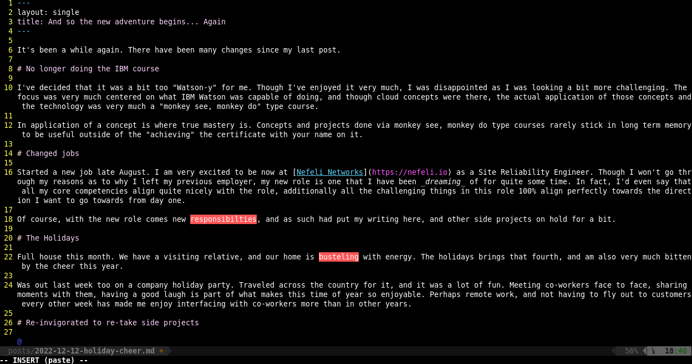
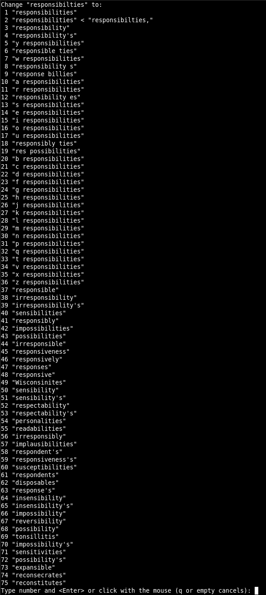

After writing yesterday's post, I realized that I had spelled a couple of things wrong. More than a couple of things wrong. So looked into spell checking in VIM.

# VIM spell checking

Apparently it's as easy to enable within vim by typing the following:
```
:setlocal spell
```

Also, the language can be specified:

```
:setlocal spell spelllang=en_us
```

Which is great! I started to use it and immediately had great results.

Below, you can see the highlighted typos. I can immediately scroll through the detected spelling mistakes by typing `]s` and `[s`.



Once on the highlighted word, typing `z=` will show suggestions of what the word could/should be, and allows easy correction by specifying which is the correctly spelled word used in it's place. An example of this is shown below.


If the word is a noun that does not show up in the dictionary, but is not incorrect spelling you can add it to the dictionary store.

I've chosen to create a spell file to add these words within my vim folder in the file `~/.vim/spell/en_us.utf-8.add`. Specified within vim as below.

```
:set spellfile=~/.vim/spell/en_us.utf-8.add
```

Words such as `Nefeli`, which is the name of the company I am currently working at, will be added to this file, and not be flagged as a spelling mistake.

It is suggested that you can point to folder that is synced to Dropbox in order to keep your word additions synced up across multiple devices.

# But... How do I auto-load onto VIM session?

All this is well and good, but, I want these extension features enabled _immediately_ onto my VIM session!

Well, took a bit of digging, but found a way to do this... Sort of.

I was able to find the lines needed to have spell checking enabled on certain types of files, like `*.md` files, or others. It could get a bit annoying if you're coding and the spell checker started to nitpick your choice of variables.

I've added the following lines to my `.vimrc`.

```
autocmd BufRead,BufNewFile *.md setlocal spell spelllang=en_us
set spellfile=~/.vim/spell/en_us.utf-8.add
autocmd FileType gitcommit setlocal spell spelllang=en_us
```

This allows spell correct to be enabled on any markdown file or within git commits I write, and also allows adding of words to the spell file which are not mistakes, but not found within an English dictionary.
